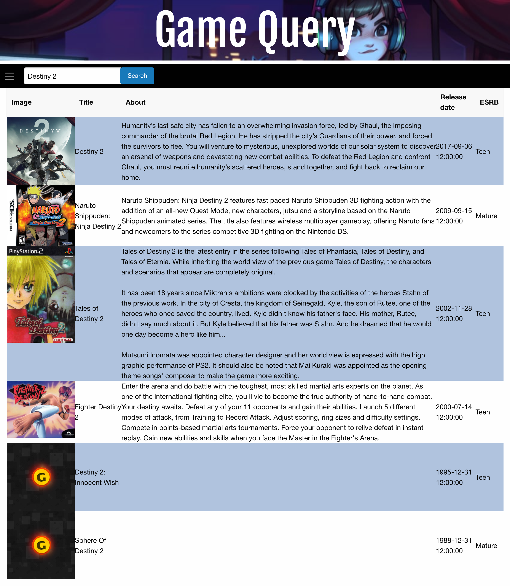

# -MH-Project-

 Description
-----------

This Project allows you to search for a game and returns information on the game you search.

user story
----------

When you enter a game name in the search box it displays the results related to that game.

Technologies
------------
Foundation framework
javascript
Jquery
gamespot and rawg apis

Links
-----
https://jeromemcc.github.io/-MH-Project-/

Link to the code repository

https://github.com/jeromemcc/-MH-Project